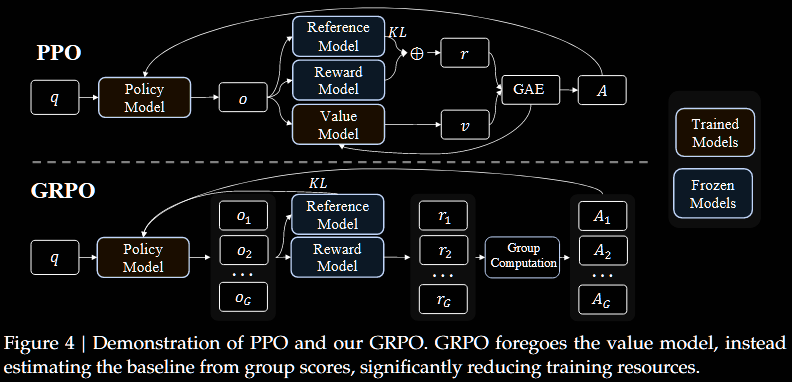

# DeepSeekMath Summary

*DeepSeekMath: Pushing the Limits of Mathematical Reasoning in Open Language Models*

*   2024-07; Shao, Wang, Zhu, Xu, Song, Bi, Zhang, Zhang, Li, Wu, Guo

## High-Level Summary

*   Introduce DeepSeekMath 7B, a LLM focused on mathematical capabilities
*   Achieves comparable performance with Minerva 540B, even with \~77x fewer parameters
*   Introduces and uses *Group Relative Policy Optimisation* (GRPO): GRPO foregoes the critic model, instead estimating the baseline from group scores
*   Provide a unified paradigm to understand different models, and use to explore reasons behind the effective RL

The main theoretical contribution is the introduction of GRPO, which extends PPO.

## PPO to GRPO

*Proximal Policy Optimisation* (PPO) is an actor—critic RL algorithm which maximises a surrogate objective:

> $\theta_{k+1} = \arg\max_\theta \mathbb E_{q, a \sim \pi_{\theta_k}}[ L_\textsf{PPO}(q, o, \theta_k, \theta) ]$

with

> $L_\textsf{PPO}(q, o, \theta', \theta) = \frac1{|o|} \sum_{t=1}^{|o|} \min\bigl\{ \frac{\pi_\theta(o_t \mid q, o_{< t})}{\pi_{\theta'}(o_t \mid q, o_{< t})} A_t, (1 + \operatorname{sgn}(A_t) \varepsilon) A_t \bigr\} - \beta D_\textsf{KL}( \pi_\theta \mathrel{\|} \pi_\textsf{rel})$.

*   $\pi_\theta$/$\pi_{\theta'}$ are the current/old policy models;
*   $q$/$o$ are questions/outputs sampled from the question dataset/old policy;
*   $A_t$ is the *advantage* based on the rewards and a learned value function;
*   $\varepsilon$ is a clipping hyperparameter for stabilising training;
*   $\beta$ is a hyperparameter governing per-token KL penalty.

The value function is treated as a baseline in estimating the advantage. In the LLM context, usually only the last token is assigned a reward score, which may complicate training a value function that is accurate at each token. *Group Relative Policy Optimisation* (GRPO) addresses this:

*   it removes the need for additional value-function approximation;
*   instead, it uses the average reward of multiple sampled outputs (to same question) as the baseline.

More specifically, for each question $q$, GRPO samples a *group* of outputs $\{o_1, ..., o_G\}$ from the old policy $\pi_{\theta'}$ and maximises an analogous surrogate objective

> $L_\textsf{GRPO}(q, \{o_1, ..., o_G\}, \theta', \theta) = \frac1G \sum_{i=1}^G L_\textsf{PPO}(q, o_i, \theta', \theta)$,

except that now the advantage $A_t$ is replaced with the estimate $\hat A_{i, t}$ based on the rewards of the outputs inside each group only; in all its glory,

> $L_\textsf{GRPO}(q, \{o_1, ..., o_G\}, \theta', \theta) = \frac1G \sum_{i=1}^G \frac1{|o_i|} \sum_{t=1}^{|o_t|} \min\bigl\{ \frac{\pi_\theta(o_{i, t} \mid q, o_{i, < t})}{\pi_{\theta'}(o_{i, t} \mid q, o_{i, < t})} \hat A_{i, t}, (1 + \operatorname{sgn}(\hat A_{i, t}) \varepsilon) \hat A_{i, t} \bigr\} - \beta D_\textsf{KL}(\pi_\theta \mathrel{\|} \pi_\textsf{rel})$.

An unbiased estimator of $D_\textsf{KL}(\pi_\theta \mathrel{\|} \pi_\textsf{rel})$ is used, namely

> $D_\textsf{KL}(\pi_\theta \mathrel{\|} \pi_\textsf{rel}) \approx \frac{\pi_\textsf{ref}(o_{i, t} \mid q, i_{i, < t})}{\pi_\theta(o_{i,t} \mid q, o_{i, < t})} - \log \frac{\pi_\textsf{ref}(o_{i, t} \mid q, i_{i, < t})}{\pi_\theta(o_{i,t} \mid q, o_{i, < t})} - 1 \ge 0$.

One of the key benefits of GRPO over PPO is not needing to learn/evaluate the advantage $A_t$, which can be costly. Two options are mentioned: "outcome" in #4.1.2 and "process" in #4.1.3. For example, in "outcome",

> $\hat A_{i,t} = (r_i - \operatorname{mean}(r)) / \operatorname{stddev}(r)$ for all $t$

where $r_i$ is the reward for $o_i$ and $r = (r_i)_{i=1}^G$; in particular, the same advantage is prescribed to each timestep $\hat A_{i,t}$.
